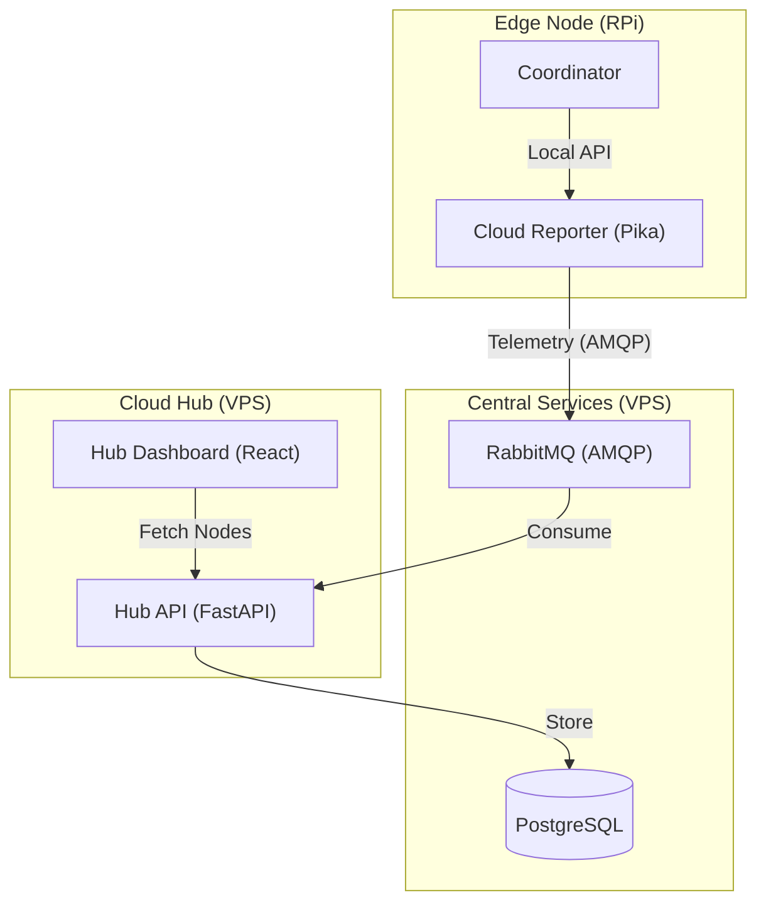

# Multi-Tenant Cloud Architecture Plan (V5.1 - Phase 6.5 Deployment)

Distributed energy optimization with central management and local resilience.

## 🎯 Implementation Status

**✅ Phase 1-3 COMPLETE**: End-to-end verified system with premium Cloud UI & Real Edge Agent.
**✅ Phase 5 COMPLETE**: Advanced Analytics, Market Prices, and Live Telemetry joined at scale.
**✅ Phase 6 COMPLETE**: Command Center V2 & Config Sync.
**✅ Phase 6.5 COMPLETE**: Production Deployment to Mikrus VPS (Restricted Ports).

---

## 1. System Components

### 1.1 Central Hub API & Dashboard (VPS) - **✅ VERIFIED**
- **Backend Engine**: FastAPI (Python) - *High-performance async.*
- **Frontend Engine**: React + Vite + TypeScript - *Premium glassmorphism UI.*
- **Purpose**: Aggregated Management with AI Decision Visibility.
- **Admin Dashboard**: Full visibility, user management, remote command center, **financial analytics**.
- **User Dashboard**: Scoped view of their node's history and status.
- **Latency**: Near real-time (5s telemetry polling).
- **Communication Core**: Centralized `MQTTManager` (singleton) for shared broker connection between background workers and API routers.
- **Authentication**: JWT with `/auth/me` endpoint for user profile retrieval.
- **Node Authentication**: X-Node-ID/X-Node-Secret headers for Edge API access (Phase 6.5).
- **CORS**: Configured for localhost dev and production domain.

### 1.2 Local Dashboard (Raspberry Pi)
- **Purpose**: Real-time Diagnostics (sub-second polling).
- **Benefit**: Offline-first. Works even without internet.
- **Config Visualization**: "Configuration" tab shows effective merged config (Phase 6.5).

### 1.3 Message Broker - **✅ VERIFIED (AMQP)**
- **Protocol**: RabbitMQ AMQP (TCP/SSL) used for production to bypass Cloudflare MQTT limitations.
- **Isolation**: Separate users for Hub (`hub_api`) and Nodes (`node_X`).
- **Access Control**: Strict vhost permissions.

#### 1.3.1 AMQP Security (Implemented)
- **Authentication**: Username/password per client.
- **ACLs**: Strict routing key isolation - nodes can only publish to `nodes.{id}.telemetry`.
- **Verification**: E2E test confirms ACL enforcement and tenant isolation.

---

## 2. Communication Strategy

Since nodes have no public IPs, they must **initiate all connections** (Outbound).

| Pattern | Use Case | Notes |
| :--- | :--- | :--- |
| **Webhooks (REST)** | Stats / Telemetry | Stateless, reliable. |
| **AMQP (Push)** | Telemetry | **✅ Implemented via Pika** |
| **Reverse SSH** | Debugging | Already implemented. |

### 2.1 Topic Design - **✅ Implemented**
(AMQP Routing Keys)
```text
nodes.{node_id}.status      # Node publishes: heartbeat
nodes.{node_id}.telemetry   # Node publishes: periodic stats
nodes.{node_id}.commands    # Hub publishes: RESTART, UPDATE
```

### 2.2 Telemetry Schema - **✅ Enhanced**
Standardized JSON payload verified in E2E tests.

### 2.3 Heartbeat & "Last Seen" Logic
- Agent publishes to `nodes.{id}.status` every **60 seconds**.
- Hub stores `last_seen_at` timestamp in DB.
- **Offline Alert**: If `now - last_seen_at > 5 minutes`, Hub marks node as `OFFLINE`.

---

## 3. Architecture Overview



---

## 4. Hub Dashboard Features - **✅ Implemented**

### 4.1 User Experience (UX)
- **Dual-Theme Engine**: Seamless Light/Dark mode synced with OS.
- **Mobile-First**: Bottom navigation bar and adaptive sidebar.
- **Glassmorphism**: Translucent panels with backdrop blur.
- **Maintainability**: Atom-based UI components (Card, Button, Input).

### 4.2 Core Pages
- **Login**: Semantic theming, form validation.
- **Fleet Overview**: Card grid showing real-time status.
- **Node Detail**: Performance charts, remote actions, **Fleet Config** card (Phase 6.5).

### 4.3 Data Connectivity
- **TanStack Query**: Aggressive caching, background refetching.
- **Real-time Updates**: Polling-based live dashboard.

### 4.4 Testing & Quality - **✅ All Tests Passing**
- **Playwright E2E Suite**: Login, Theme, Navigation verified.
- **Production Build**: Vite optimized build deployed to Nginx.

---

## 5. Security - **✅ Hardened**
- **Node Auth**: Dedicated credentials per node + X-Node-ID/X-Node-Secret headers.
- **Timing-Attack Safe**: `secrets.compare_digest` for secret comparison (PE Review).
- **Encryption**: All traffic over SSL/TLS.
- **AMQP ACLs**: Strict Broker Access Control. 
- **Database Migrations**: Alembic manages schema versions.
- **JWT Authentication**: Secure token-based auth.
- **CORS**: Configured allow-list.

---

## 6. Service Distribution

| Service | Host | Status |
| :--- | :--- | :--- |
| Master Coordinator | RPi | Existing |
| Management Agent | RPi | **✅ Deployed (AMQP)** |
| Cloud Hub API | VPS | **✅ Live (Port 40316)** |
| Hub Dashboard | VPS | **✅ Live (Port 40317)** |
| PostgreSQL | Managed | Configured |
| Message Broker | RabbitMQ | **✅ Verified (AMQP)** |

---

## 7. Phase 6.5 Deployment Strategy (NEW)

### 7.1 Safe Deployment Checklist

#### Hub API (VPS)
1. **Pre-flight**: Run `pytest hub-api/tests/ -v` locally.
2. **Backup**: Snapshot the PostgreSQL database.
3. **Deploy**: `git pull && docker-compose up -d --build`
4. **Verify**: `curl http://srv26.mikr.us:40314/health`
5. **Rollback**: `docker-compose down && git checkout HEAD~1 && docker-compose up -d`

#### Edge Node (RPi)
1. **Pre-flight**: SSH to node, verify `systemctl status goodwe-*`.
2. **Trigger**: Send `DEPLOY` command via Hub UI or AMQP.
3. **Syntax Check**: `self-update.sh` runs `py_compile` on all Python files.
4. **Abort on Error**: If syntax errors, update is aborted automatically.
5. **Verify**: Check telemetry in Hub UI within 60s.

### 7.2 Layered Configuration Protection
- `*_local.yaml` files are protected from `git reset --hard`.
- `.gitignore` includes `*_local.yaml` pattern.
- If tracked by accident, user is warned.

### 7.3 Price Data Fallback Chain
1. **Primary**: Hub API `/stats/market-prices`
2. **Secondary**: Local price cache (`data/price_cache.json`)
3. **Tertiary**: Direct PSE API (last resort)

---

## 8. Next Steps & Recommendations

### ✅ Completed Milestones
- **Phase 6.5.1**: Node Authentication for price API.
- **Phase 6.5.3**: Config Visualization UI (Edge tab, Hub card).
- **PE Review**: Security hardening (timing-safe comparison, debug prints removed).

### 🚀 Future Roadmap
1. **SSL/TLS Enforcement**: Let's Encrypt for VPS, AMQPS for RabbitMQ.
2. **Multi-Node Scaling**: Pagination, 100+ node stress test.
3. **Financial Analytics Deep-Dive**: Exportable reports.

---

## 9. Success Metrics (Post-Launch)
- **Uptime**: Hub API availability (target: 99.9%).
- **Latency**: Dashboard load time (target: < 2s).
- **Node Health**: % of nodes online (target: > 95%).
- **Migration**: 100% of telemetry via AMQP.

---

**Document Status**: V6.0 - Production Live
**Last Updated**: 2026-01-14
