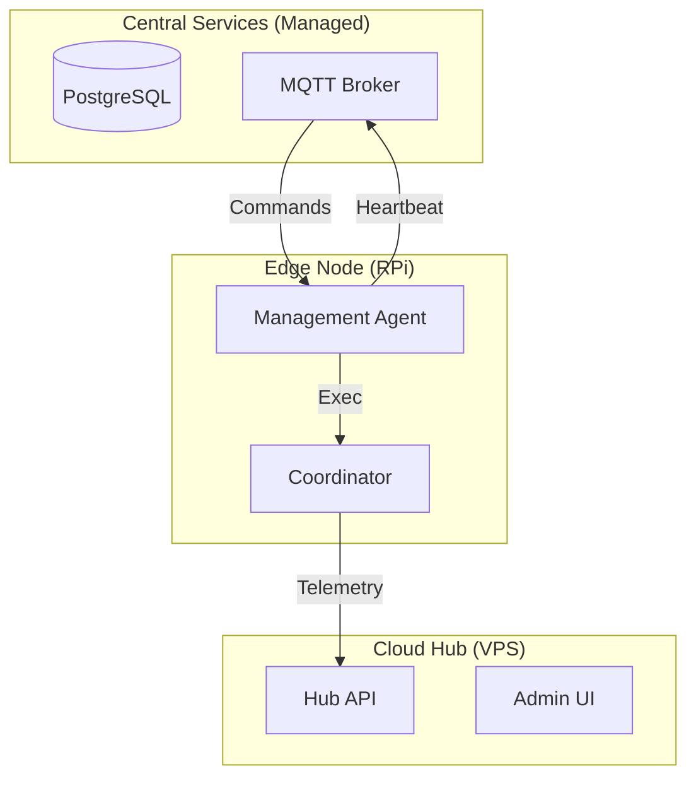

# Multi-Tenant Cloud Architecture Plan (V3.1)

Distributed energy optimization with central management and local resilience.

## 1. System Components

### 1.1 Central Hub API & Dashboard (VPS)
- **Backend Engine**: FastAPI (Python) - *High-performance async.*
- **Frontend Engine**: React (Vite/Next.js) - *Modern state management.*
- **Purpose**: Aggregated Management.
- **Admin Dashboard**: Full visibility, user management, remote command center.
- **User Dashboard**: Scoped view of their node's history and status.
- **Latency**: Near real-time (1-5 min updates).

### 1.2 Local Dashboard (Raspberry Pi)
- **Purpose**: Real-time Diagnostics (sub-second polling).
- **Benefit**: Offline-first. Works even without internet.

### 1.3 External Managed Services
- **Database**: Managed PostgreSQL (Supabase, Neon).
- **Message Broker**: Managed MQTT (CloudAMQP, HiveMQ).

## 2. Communication Strategy

Since nodes have no public IPs, they must **initiate all connections** (Outbound).

| Pattern | Use Case | Notes |
| :--- | :--- | :--- |
| **Webhooks (REST)** | Stats / Telemetry | Stateless, reliable. |
| **MQTT** | Real-time Commands | Persistent connection for push. |
| **Reverse SSH** | Debugging | Already implemented. |

### 2.1 MQTT Topic Design

```text
nodes/{node_id}/status      # Node publishes: heartbeat, online/offline
nodes/{node_id}/telemetry   # Node publishes: periodic stats
nodes/{node_id}/commands    # Hub publishes: RESTART, UPDATE, CONFIG_PUSH
nodes/{node_id}/logs        # Node publishes: on-demand log chunks
hub/broadcast               # Hub publishes: global announcements
```

### 2.2 Heartbeat & "Last Seen" Logic
- Agent publishes to `nodes/{id}/status` every **60 seconds**.
- Hub stores `last_seen_at` timestamp in DB.
- **Offline Alert**: If `now - last_seen_at > 5 minutes`, Hub marks node as `OFFLINE`.

## 3. Architecture Overview



## 4. Key Functionalities

### A. Central Configuration
- Hub DB maps Users → Node IDs.
- Hub stores `.yaml` config per node.
- Hub tracks `git_commit` for version rollouts.

### B. Remote Log Access (On-Demand)
1. Admin requests logs via MQTT.
2. Agent reads last 500 lines.
3. Agent uploads via `POST /api/logs`.

### C. Automated Updates (Private Git)
- Each node has a unique **SSH Deploy Key** (read-only).
- Agent executes: `git fetch && git checkout [tag]`.
- Checks for `requirements.txt` changes → runs `pip install` if needed.
- Restarts service via `systemctl`.

## 5. Node Provisioning

**Manual approach for initial devices:**
1. Generate SSH Deploy Key.
2. Register UUID and public key in Hub DB.
3. Set `NODE_SECRET` in local config.
4. Agent connects, authenticates, and pulls settings.

*Note: Automated "Dynamic Enrollment" (via serial number) planned for post-50 nodes.*

## 6. Critical Risks & Mitigations

| Risk | Mitigation |
| :--- | :--- |
| **Invalid Config** | Agent rollback to `config.yaml.bak`. |
| **Offline Periods** | SQLite buffer (Max 1GB, FIFO), batch upload on reconnect. |
| **Clock Drift** | Hub alerts if timestamp differs >60s. |

## 7. Service Distribution

| Service | Host | Status |
| :--- | :--- | :--- |
| Master Coordinator | RPi | Existing |
| Management Agent | RPi | New |
| Cloud Hub API | VPS | New |
| Hub Dashboard | VPS | New |

## 8. Advanced Operations

| Topic | Strategy |
| :--- | :--- |
| **Tenant Isolation** | PostgreSQL RLS (Row-Level Security). |
| **Atomic Updates** | Download to temp, run tests, symlink swap. |
| **Secret Management** | Hash `NODE_SECRET` in DB. |
| **Rate Limiting** | Per-node throttling to protect Hub. |
| **Audit Logs** | Log all remote commands with Admin ID. |

## 9. Repository Structure (Modular Monorepo)

```text
goodwe-dynamic-price-optimiser/
├── edge/                 # RPi (Python)
├── hub-api/              # VPS Backend (FastAPI)
├── hub-dashboard/        # VPS Frontend (React)
└── shared/               # JSON Schemas (Pydantic)
```

**Isolation**: Each folder has its own `requirements.txt` / `package.json`.

## 10. Security

- **Node Auth**: Each Pi signs requests with `NODE_SECRET`.
- **Encryption**: All traffic over HTTPS/WSS.
- **Command Whitelist**: No arbitrary shell execution.
- **MQTT ACLs**: Strict Broker Access Control. `user=node_X` can separate read/write only to `nodes/node_X/#`.

## 10.1 Edge OS Maintenance

Long-running devices require automated security patching.

**Strategy: Unattended Upgrades (Debian built-in)**

```bash
sudo apt install unattended-upgrades
sudo dpkg-reconfigure unattended-upgrades  # Select "Yes"
```

**Recommended: Enable auto-reboot at 3 AM** (safe – `systemd` auto-restarts services):

Add to `/etc/apt/apt.conf.d/50unattended-upgrades`:
```
Unattended-Upgrade::Automatic-Reboot "true";
Unattended-Upgrade::Automatic-Reboot-Time "03:00";
```

**Hub Monitoring**: Agent reports `os_version` and `last_reboot` in telemetry.

**Future (10+ nodes)**: Add `OS_UPDATE` command for staged rollouts.

## 10.2 Remote Troubleshooting (Emergency Access)

When automated commands fail and you need direct shell access to a Pi behind NAT:

**Strategy: Reverse SSH Tunnel (Already Implemented)**

1. **Pi initiates tunnel** to VPS on boot:
   ```bash
   ssh -R 2222:localhost:22 user@vps -N
   ```
2. **From VPS, you connect back** to the Pi:
   ```bash
   ssh -p 2222 pi@localhost
   ```

**Trigger Modes:**
| Mode | Description |
| :--- | :--- |
| **Always-On** | Tunnel runs permanently via `systemd`. Good for dev/test. |
| **On-Demand** | Hub sends `OPEN_TUNNEL` via MQTT; Agent starts tunnel for 15 min. Lower resource use. |

**Security**: Tunnel only opens SSH (port 22). VPS firewall blocks external access to tunnel ports.

> [!TIP]
> You already have `goodwe-vps-tunnel.service` for this. This is your "break glass" option when all else fails.

## 11. Authentication & Authorization

| Role | Permissions |
| :--- | :--- |
| **Admin** | Full access: all nodes, users, commands. |
| **User** | Read-only: own node's telemetry and history. |

**Auth Flow**:
1. User logs in via Hub Dashboard (Email/Password or OAuth via Supabase Auth).
2. Hub issues a **JWT** with `user_id` and `role`.
3. API validates JWT on every request and enforces scope.

## 12. Observability & Alerting

### 12.1 Metrics Collection
- **Edge Agent** exposes `/metrics` endpoint (Prometheus format).
- Metrics: CPU, Memory, Disk, Uptime, Coordinator status.
- Hub scrapes or Agent pushes metrics periodically.

### 12.2 Centralized Logging
- On-demand log retrieval (existing).
- Future: **Loki** or **Seq** for structured log aggregation.

### 12.3 Alerting Rules

| Alert | Condition | Severity |
| :--- | :--- | :--- |
| **Node Offline** | `last_seen > 5 min` | Critical |
| **Low Disk Space** | `disk_free < 500 MB` | Warning |
| **Update Failed** | Agent reports error | Critical |
| **High Error Rate** | >10 errors in 1 hour | Warning |
| **Clock Drift** | `drift > 60s` | Warning |

**Delivery**: Email, Slack, or PagerDuty via webhooks.

## 13. Backup & Disaster Recovery

| Component | Strategy | Frequency |
| :--- | :--- | :--- |
| **PostgreSQL DB** | Managed provider snapshots + daily `pg_dump` to S3. | Daily |
| **VPS Config** | Git-tracked (Infrastructure as Code). | On change |
| **Edge SQLite** | Nodes self-recover; data is non-critical (telemetry). | N/A |

**Recovery Runbook**:
1. Restore DB from latest snapshot.
2. Redeploy Hub API/Dashboard from Git.
3. Nodes auto-reconnect and re-sync.

## 14. CI/CD & Deployment

### 14.1 GitHub Actions Pipelines

| Trigger | Path Filter | Actions |
| :--- | :--- | :--- |
| PR to `main` | `edge/**` | Lint, Test (pytest) |
| PR to `main` | `hub-api/**` | Lint, Test, Build Docker image |
| PR to `main` | `hub-dashboard/**` | Lint, Build |
| Merge to `main` | `hub-api/**` | Deploy to VPS via SSH/Docker |
| Merge to `main` | `hub-dashboard/**` | Build & Deploy static files |

### 14.2 Edge Updates
- Deployed via `SELF_UPDATE` MQTT command (not CI/CD push).
- Admin triggers from Hub Dashboard.

## 15. Schema Versioning

- **API Versioning**: All endpoints prefixed with `/api/v1/`.
- **Schema Evolution**: Additive changes only (new fields, not breaking).
- **Deprecation**: Old endpoints supported for 2 major versions.

## 16. Data Retention Policy

Applies to **both Edge (SQLite)** and **Cloud (PostgreSQL per node)**.

| Data Type | Edge (SQLite) | Cloud (PostgreSQL) | Aggregation |
| :--- | :--- | :--- | :--- |
| **Raw Telemetry** | 7 days | 30 days | Deleted after limit |
| **Cost & Savings** | 1 year | 2 years | No aggregation |
| **Daily Usage Stats** | 1 year | 30 days detailed | Then → monthly summary |
| **Monthly Summaries** | 1 year | Indefinite | Minimal footprint |

**Sync**: Edge uploads to Cloud, then local cleanup runs. Cloud runs nightly aggregation job.

## 17. Implementation Roadmap

### Phase 1: Infrastructure Setup
**Goal**: Establish cloud services and monorepo structure.

| Step | Task | Deliverable |
| :--- | :--- | :--- |
| 1.1 | Create monorepo structure (`edge/`, `hub-api/`, `hub-dashboard/`, `shared/`) | Directory layout with isolated `requirements.txt` / `package.json` |
| 1.2 | Provision managed PostgreSQL (Supabase or Neon) | Connection string, `nodes` and `users` tables created |
| 1.3 | Provision managed MQTT broker (CloudAMQP or HiveMQ) | Broker URL, credentials, test publish/subscribe |
| 1.4 | Setup VPS (Mikrus) with Docker | Docker installed, SSH access confirmed |

---

### Phase 2: Edge Management Agent
**Goal**: Build the agent that runs on Raspberry Pi alongside the Coordinator.

| Step | Task | Deliverable |
| :--- | :--- | :--- |
| 2.1 | Create `edge/agent/` Python package | Basic structure with `__main__.py` |
| 2.2 | Implement MQTT client (connect, subscribe to `nodes/{id}/commands`) | Agent connects to broker on startup |
| 2.3 | Implement heartbeat (publish to `nodes/{id}/status` every 60s) | Heartbeat visible in broker logs |
| 2.4 | Implement command handlers: `RESTART`, `FETCH_LOGS` | Agent can restart Coordinator, read logs |
| 2.5 | Create `systemd` service for Agent | `goodwe-agent.service` added to repo |
| 2.6 | Generate Node UUID (from `/proc/cpuinfo` serial or `uuid` file) | Unique ID per device |

---

### Phase 3: Hub API (FastAPI)
**Goal**: Central API for telemetry ingestion, node management, and auth.

| Step | Task | Deliverable |
| :--- | :--- | :--- |
| 3.1 | Scaffold FastAPI project in `hub-api/` | Running on `localhost:8000` with `/health` endpoint |
| 3.2 | Database models: `nodes`, `users`, `telemetry`, `commands_audit` | SQLAlchemy/Pydantic models, migrations |
| 3.3 | `POST /api/v1/telemetry` - ingest stats from nodes | Endpoint stores data in PostgreSQL |
| 3.4 | `GET /api/v1/nodes` - list nodes with last_seen | Admin can view all nodes |
| 3.5 | `POST /api/v1/nodes/{id}/command` - send MQTT command | Hub publishes to broker |
| 3.6 | JWT auth middleware (Supabase Auth or custom) | Protected endpoints require valid token |
| 3.7 | RBAC: Admin vs User scope filtering | User only sees their node(s) |

---

### Phase 4: Hub Dashboard (React)
**Goal**: Web UI for admins and users.

| Step | Task | Deliverable |
| :--- | :--- | :--- |
| 4.1 | Scaffold React app with Vite in `hub-dashboard/` | Running on `localhost:5173` |
| 4.2 | Login page (integrates with Supabase Auth or custom JWT) | User can log in |
| 4.3 | Admin: Node list with status (online/offline) | Table with last_seen indicator |
| 4.4 | Admin: Send command (restart, fetch logs) | Button triggers API call |
| 4.5 | User: Telemetry dashboard (charts, history) | Graphs for their node |
| 4.6 | Deploy to VPS (Nginx static hosting) | Accessible via public URL |

---

### Phase 5: Telemetry Integration
**Goal**: Connect Coordinator to Hub.

| Step | Task | Deliverable |
| :--- | :--- | :--- |
| 5.1 | Add HTTP client to Coordinator for `POST /api/v1/telemetry` | Stats uploaded every 5 min |
| 5.2 | Implement SQLite buffer for offline periods | Data queued locally, batch uploaded on reconnect |
| 5.3 | Add `node_id` header (signed with `NODE_SECRET`) | Hub authenticates incoming requests |

---

### Phase 6: Config & Updates
**Goal**: Remote configuration and software updates.

| Step | Task | Deliverable |
| :--- | :--- | :--- |
| 6.1 | Hub stores `config.yaml` per node in DB | Admin can edit config in UI |
| 6.2 | Agent: `CONFIG_PUSH` command handler | Agent downloads config, applies, restarts |
| 6.3 | Agent: Rollback on invalid config | Backup → apply → health check → revert if failed |
| 6.4 | Agent: `SELF_UPDATE` command (git fetch, checkout, restart) | Admin can trigger version rollout |
| 6.5 | Hub tracks `current_version` per node | Dashboard shows version status |

---

### Phase 7: Observability & Alerting
**Goal**: Monitoring and alerts.

| Step | Task | Deliverable |
| :--- | :--- | :--- |
| 7.1 | Agent: `/metrics` endpoint (CPU, disk, memory) | Prometheus-compatible |
| 7.2 | Hub: Offline detection (last_seen > 5 min) | Node marked OFFLINE in DB |
| 7.3 | Hub: Alert webhook (Slack/Email) | Notification on critical events |
| 7.4 | Data retention cron job | Nightly aggregation + cleanup |

---

### Phase 8: Hardening & Launch
**Goal**: Production readiness.

| Step | Task | Deliverable |
| :--- | :--- | :--- |
| 8.1 | PostgreSQL RLS for tenant isolation | Users cannot access other tenants' data |
| 8.2 | Rate limiting on Hub API | Per-node throttling |
| 8.3 | Audit logging for all commands | `commands_audit` table populated |
| 8.4 | CI/CD pipelines (GitHub Actions) | Automated tests + deploy on merge |
| 8.5 | Documentation (README, API docs) | OpenAPI spec published |

---

> [!TIP]
> Start with **Phase 1 & 2** in parallel. The Agent can be developed locally while cloud infra is provisioned.

